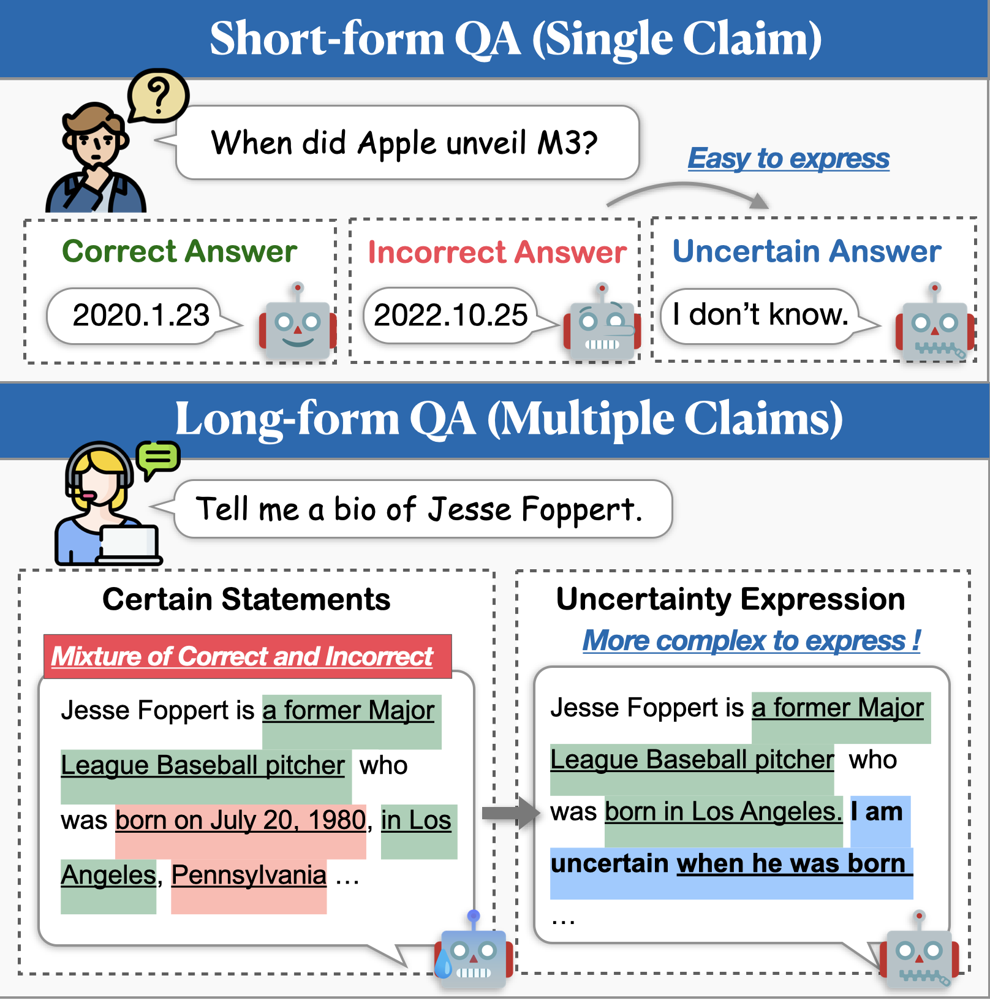
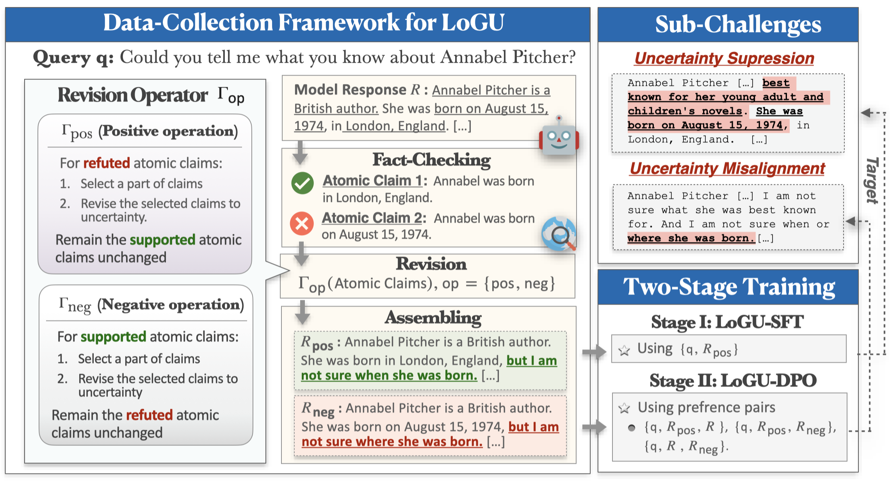

<div align="center">

# LoGU: Long-form Generation with Uncertainty Expressions


<div>
  <a href='https://scholar.google.com/citations?user=asTSVwQAAAAJ&hl=en' target='_blank'><b>Ruihan Yang</b></a><sup>1</sup>&emsp;
  <a href='https://caiqizh.github.io/' target='_blank'><b>Caiqi Zhang</b></a><sup>2</sup>&emsp;
  <a href='https://scholar.google.co.jp/citations?user=373vlUEAAAAJ&hl=en' target='_blank'><b>Zhisong Zhang</b></a><sup>3</sup>&emsp;
</div>
<div><sup>1</sup>Fudan University</div>
<div><sup>2</sup>University of Cambridge</div>
<div><sup>3</sup>Tencent AI Lab</div>

<div>

<h4>

 


</h4>
</div>



</div> <!-- 关闭外层的居中div -->


## Introduction

While Large Language Models (LLMs) demonstrate impressive capabilities, they still struggle with generating factually incorrect content (i.e., hallucinations). A promising approach to mitigate this issue is enabling models to express uncertainty when unsure. Previous research on uncertainty modeling has primarily focused on short-form QA, but real-world applications often require much longer responses. In this work, we introduce the task of Long-form Generation with Uncertainty (LoGU). We identify two key challenges: **Uncertainty Suppression**, where models hesitate to express uncertainty, and **Uncertainty Misalignment**, where models convey uncertainty inaccurately. 

To tackle these challenges, we propose a refinement-based data collection framework and a two-stage training pipeline. Our framework adopts a divide-and-conquer strategy, refining uncertainty based on atomic claims. The collected data are then used in training through supervised fine-tuning (SFT) and direct preference optimization (DPO) to enhance uncertainty expression. Extensive experiments on three long-form instruction following datasets show that our method significantly improves accuracy, reduces hallucinations, and maintains the comprehensiveness of responses.

<div align="center">

</div>

## How to Install

You can use the following commands to install the environment for LoGU:

```sh
conda create -n LoGU python==3.8
conda activate LoGU
pip install -r lf_requirements.txt
pip install -r vllm_requirements.txt
```

## Run

Try the following command to test our method on Bios, LongFact, WildHallu:
- Generate answers
```sh
cd ./scripts
bash generate_vllm_responses.sh
```
- Calculate Factual Accuracy(FA)
```sh
bash eval_pipeline.sh
```
- Calculate Uncertain Precision(UC)
```sh
bash generate_unc_answers.sh
bash factcheck_unc_answers.sh
```
## Training Data

Training data for LoGU-SFT and LoGU-DPO in the paper can be found [here](https://drive.google.com/drive/folders/1pRocQI0Jv479G4vNMtQn1JOq8Shf2B6U?usp=sharing).


We also provide some uncertainty expression models on the huggingface model hub for fast trail:

| Model | Link |
| :------- | :---------: |
| **rhyang2021/uncertain_llama3_8b** | [HuggingFace](https://huggingface.co/rhyang2021/uncertain_llama3_8b)|
| **rhyang2021/uncertain_mistral_7b** | [HuggingFace](https://huggingface.co/rhyang2021/uncertain_mistral_7b)|

If you have any questions, please feel free to [email](mailto:rhyang17@fudan.edu.cn) me or drop me an issue.
